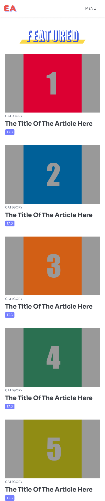

# EA Front End Challenge
Hello  the following is a couple of tasks that will help demonstrate your skillset and introduce you to some of the tools and process we use at EA.

## Challenge Overview

1. Clone & Familiarize yourself with the projects  app structure, folder structure  and technologies
2. Check out the link to the Figma Design File
3. Use the Figma File as a guide to building the Page for "Desktop & Mobile"
4. make the edits to the code and test locally
5. your goal as FrontEnd engineer for this challenge is to update /edit/ style etc to get the App as close to the Figma Design
6. when complete, push your branch to repo
7.  we can discuss durign next interview!

### EA's App Structure

## Current Project Build

At the core it's HTML/CSS and Javascript.

We use  the javascript library [ReactJS](https://reactjs.org)

We use the React framework
[NextJS](https://nextjs.org/learn/basics/create-nextjs-app)

We are currently using Chakra-UI for our UI Library.
[chakra-ui](https://chakra-ui.com/)

Figma Design File:
[FrontEndChallenge](https://www.figma.com/file/dFFaPvdPrl9Ib1MtqXtPS1/FrontEnd-Challenge?node-id=0%3A1)
## How to complete challenge

1. Clone Repo and make a branch
2. Using the App Structure guide Diagram, the projects App structure, and the Figma Design digram to build the necessary Modules, Components, Elements, etc...
3. ChakraUI is installed but if you can solve th problem with `CSS`, `Another UI Lib`, `CSS-In-JS`, or similiar process by all means
4. Some Modules, and Layouts are already created so you need only edit and style them to match Figma
5. The assets and data is already in project or accessible via mock data in project folder
6.  Focus on Layout and Design for both "Desktop & Mobile"
7. test locally
8. push your branch before interview and then we can discuss

### Design Images

## Notes
- [THINKING IN REACT](https://reactjs.org/docs/thinking-in-react.html)

- [ReactJS](https://reactjs.org)

- [NextJS](https://nextjs.org/learn/basics/create-nextjs-app)

- [chakra-ui](https://chakra-ui.com/)

- [Figma Share Link](https://www.figma.com/file/dFFaPvdPrl9Ib1MtqXtPS1/FrontEnd-Challenge?node-id=0%3A1)