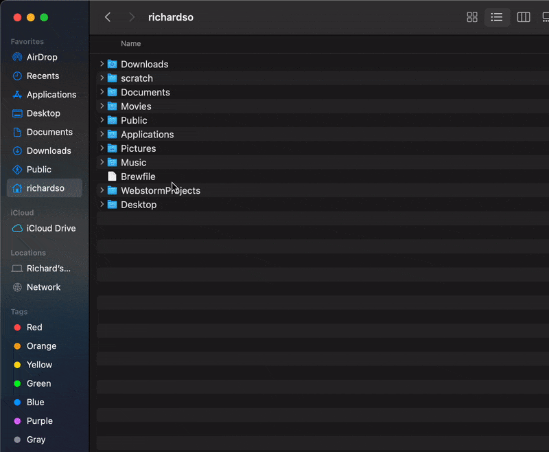

# M1 Developer Setup
---
## Install Rosetta via CLI

1. Locate **Terminal** App in *Applications/Utilities/Terminal*
2. Open  **Terminal** App (this will be the Native Terminal App)
3. Install Rosetta 2
    * RUN: `/usr/sbin/softwareupdate --install-rosetta --agree-to-license on`

---
## Install Xcode CLT
1. In **Terminal** app
2. RUN: `xcode-select --install`

---
## Create **TerminalRosetta**


1. Locate **Terminal** App in *Applications/Utilities/Terminal*
2. `Right Click` **Terminal** App and select *Duplicate*
3. Select newly duplicated **Terminal** App and  rename to **TerminalRosetta**
4. `Right Click` **TerminalRosetta** App and select *Get Info* -> *Open using Rosetta*

## Install (Native) Homebrew:
[brew.sh](https://brew.sh)

1. Inside (Native) **Terminal** app
2. RUN: `/bin/bash -c "$(curl -fsSL https://raw.githubusercontent.com/Homebrew/install/HEAD/install.sh)"`

## Install Better Terminal App (iTerm2)
[iterm2.com](https://iterm2.com/)

1. In (Native) **Terminal** app RUN: `brew install --cask iterm2`
2. Close **Terminal** app

## Open **iTerm2** app and use going forward


## Install VS Code
[code.visualstudio.com/](https://code.visualstudio.com/)
1. Open **iTerm2** app
2. Install **VS Code**
   * RUN: `brew install --cask visual-studio-code`

## Install Oh-My-Zsh
[ohmyz.sh](https://ohmyz.sh/)
[https://github.com/ohmyzsh/ohmyzsh/wiki](https://github.com/ohmyzsh/ohmyzsh/wiki)
1. Open **iTerm2** app
2. Install **oh-my-zsh**
   * RUN: `sh -c "$(curl -fsSL https://raw.githubusercontent.com/ohmyzsh/ohmyzsh/master/tools/install.sh)"`
3. INstall Custom PLugins:
   * **zsh-autosuggestions** RUN: `git clone https://github.com/zsh-users/zsh-autosuggestions ${ZSH_CUSTOM:-~/.oh-my-zsh/custom}/plugins/zsh-autosuggestions`
   * **zsh-syntax-highlighting** RUN: `git clone https://github.com/zsh-users/zsh-syntax-highlighting.git ${ZSH_CUSTOM:-~/.oh-my-zsh/custom}/plugins/zsh-syntax-highlighting`
---
## Open and EDit Shell Config (ZSHRC)

### Open .zshrc
1. Open **iTerm2** app
2. RUN: `open ~/.zshrc`

### Activate **oh-my-zsh plugins**

find the `plugins=()` Line and change to the following:
```
# Add wisely, as too many plugins slow down shell startup.

plugins=(osx git brew iterm2 npm nvm yarn zsh-autosuggestions zsh-syntax-highlighting)

```
### Add some **Aliases**

find the `# Example aliases` line uncomment or add alias:
```
  # Example aliases
  alias zshconfig="code ~/.zshrc"
  alias ohmyzsh="code ~/.oh-my-zsh"
  alias brewr="arch -x86_64 /usr/local/bin/brew"
  alias brew="arch -arm64e /opt/homebrew/bin/brew"

  ```
  if you need use the rosetta2 or intel version of brew, you can use `brewr` inplace of `brew`

### Add **PATHS** to end of file:
```
export PATH="/usr/local/bin:$PATH"
export PATH="/opt/homebrew/bin:$PATH"

```
### Example of `.zshrc` file
[M1 Dev .zshrc](../devs/m1-tech/zshrc)

---

## Install NVM (Node Version Manager) and latest version of NodeJS

[https://github.com/nvm-sh/nvm](https://github.com/nvm-sh/nvm)
1. Quit and re-Open **iTerm2** app
2. Install **NVM** (Node Version Manager)
   * RUN: `curl -o- https://raw.githubusercontent.com/nvm-sh/nvm/v0.38.0/install.sh | bash`
3. Quit and re-Open **iTerm2** app
4. Verify **NVM**
   * RUN: `nvm --version`
5. Install latest version of **NodeJS**
   * RUN: `nvm install node`

## Install yarn (global)
[https://yarnpkg.com/getting-started/install](https://yarnpkg.com/getting-started/install)
1. Open **iTerm2** app
2. Install **Yarn**
   * RUN: `npm install -g yarn`

## Install MAS
a simple CL tool for installing Mac App Store Apps
[https://github.com/mas-cli/mas](https://github.com/mas-cli/mas)
* RUN: `brew install mas`

## Install Cask Fonts & a Font
a homebrew tap for installing fonts
[https://github.com/Homebrew/homebrew-cask-fonts](https://github.com/Homebrew/homebrew-cask-fonts)
* RUN (only once):`$ brew tap homebrew/cask-fonts`
* RUN (for each font you want): `brew install font-fira-code`

## Install Browsers
1. Chrome
   * RUN: `brew install --cask google-chrome`
1. Firefox
   * RUN: `brew install --cask firefox`
1. Brave
   * RUN: `brew install --cask brave-browser`


## Install Insomnia
An API testing tool

[insomnia.rest/products/insomnia](https://insomnia.rest/products/insomnia)
* RUN: `brew install --cask insomnia`


## Install Docker
build container platform

[www.docker.com/](https://www.docker.com/)
* RUN: `brew install --cask docker`


### Install Discord
A chat platform

[discord.com/](https://discord.com/)

**As of 05-24-2021 need to install intel version**

* RUN: `brewr install --cask discord`
