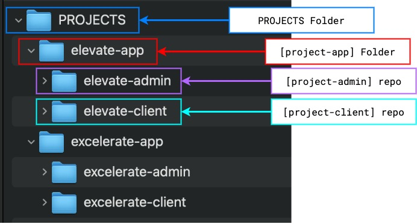
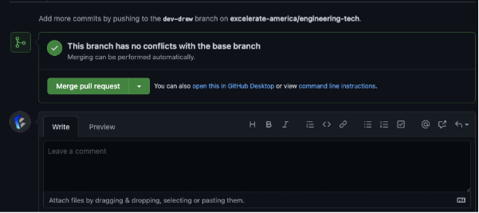
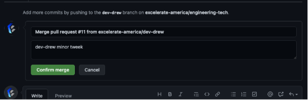

# EA Projects and Process

## Overview Local Folder Structure
---
```
{HOME}/
    PROJECTS/
        [project-app]/
            [project-client/]
            [project-admin/]
```
---

### **`{HOME}`** Folder:
* `/Users/[username]`
* iterm2 will open in your `{HOME}` folder


### **`PROJECTS`** Folder:
* from inside  **`{HOME}`** Folder run:
  * `mkdir PROJECTS`
* (only create the first time)

### **`project-app`** Folder:
* each EA Project may have more than one associated *`sub-app`*  usually a `client` app and an `admin` app and each will have it's own `repo`
* So before cloning any repos make sure to create the correct `project-app` Folder
  * `mkdir [project-app]`

### **`project-client`** repo:
* from inside `[project-app]` folder
* clone the appropriate `project-client` from github

### **`project-admin`** repo:
* from inside `[project-app]` folder
* clone the appropriate `project-admin` from github




## For internal Projects without deployment

### change directory to local **`[project-]`** repo
* `cd ~/PROJECTS/[project-app]/[project-repo]`

### Pull any Changes from remote repo `main` branch
* `pull origin main`

### **NEVER** make changes to `main` repo directly! Create your own `dev-username` branch
* `get checkout -b dev-username`

### Inside your `dev-username` branch make any changes
* make edits to source files

### Periodically add files and commit them locally with descriptive comments
* **`ADD` & `COMMIT` Latest** :
  * `git add -A`
  * `git commit -m "descriptive details"`

### When you are finished for the day or have finished a specific feature or task
* make sure to >  **`ADD` & `COMMIT` Latest**
* Then **`PUSH`** to your `dev-username` branch
  * `git push origin dev-yourname`

### If you have finished a specific feature or task and are ready to merge with `main`
* make sure you have >
  * **`ADD` & `COMMIT` Latest**
  * **`PUSH`** to your `dev-username` branch
* Then go to **`github.com`** website

### Complete code merge steps from github.com website
* 
* 
* 
* 


## Continous Integration  and GitHub Actions to come!