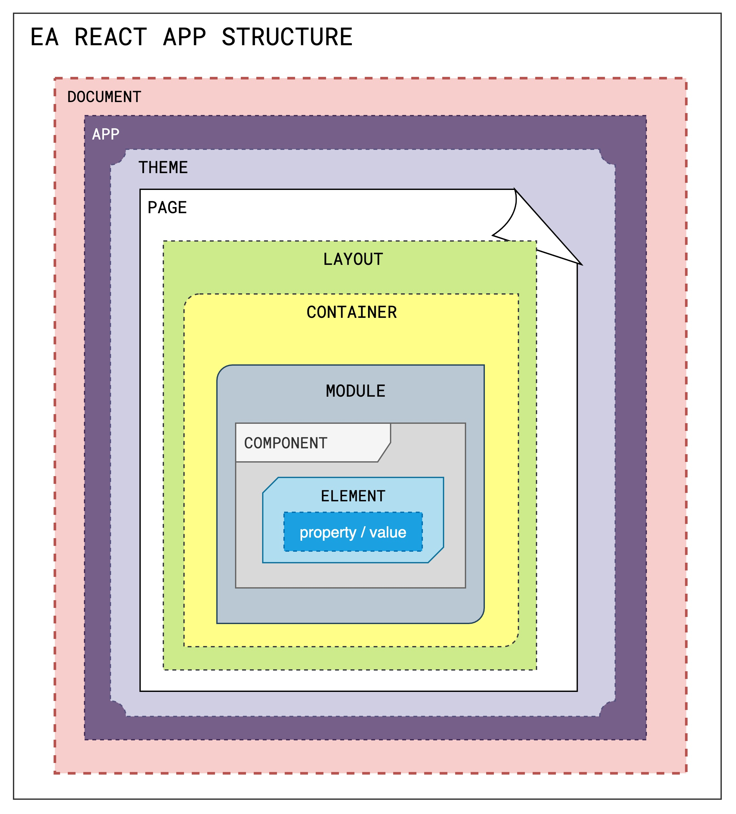
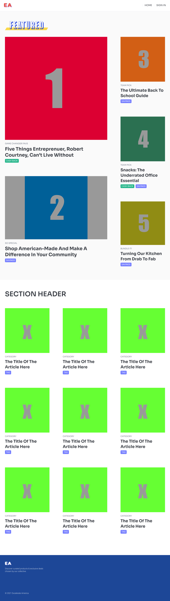
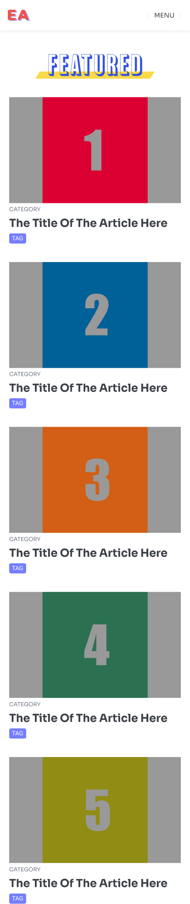

# EA Front End Challenge
The following project is setup similiar to how our current projects are  strutured, which includes some of our current programming  languages, tools, and libraries. 
This project will give you a glimpse of how we work as well as give you anopportunity to show case your skillset.
**Please contact me, if you think this is unreasonable or confusing.**

## Challenge Overview
As the Front-End engineer  your  challenge is to  create a version of this project  that is as close to the Figma Design Doc as possible.

1. Clone project Repo and make a branch
2. Using theis projects folder structure, the included diagrams, the link to the Figma Design Doc, and your skillz  to finish building this  Single Page web  App
8. The data and assets are already in the project or accessible via mock data in project folder
9. Some Layouts, Modules, Components, and Elements are already created so you need only update/edit them to look like the figma doc, some Some Layouts, Modules, Components, and Elements you will need to use figma doc as guide and create
12. ChakraUI is installed but if you can solve the problem with `CSS`, `Another UI Lib`, `CSS-In-JS`, or similiar process by all means
14. Focus on Layout and Design for both "Desktop & Mobile" and try and match Figma doc
15. build and test locally then push your branch before the interview 
16. Then we can discuss

**🚨 if your portfolio contains a project that is similar please contact me! 🚨**

### EA's App Structure

## Current Project Build

At the core it's HTML/CSS and Javascript.

We use  the javascript library [ReactJS](https://reactjs.org)

We use the React framework
[NextJS](https://nextjs.org/learn/basics/create-nextjs-app)

We are currently using Chakra-UI for our UI Library.
[chakra-ui](https://chakra-ui.com/)

Figma Design File:
[FrontEndChallenge](https://www.figma.com/file/dFFaPvdPrl9Ib1MtqXtPS1/FrontEnd-Challenge?node-id=0%3A1)

### Design Images

## Notes
- [THINKING IN REACT](https://reactjs.org/docs/thinking-in-react.html)

- [ReactJS](https://reactjs.org)

- [NextJS](https://nextjs.org/learn/basics/create-nextjs-app)

- [chakra-ui](https://chakra-ui.com/)

- [Figma Share Link](https://www.figma.com/file/dFFaPvdPrl9Ib1MtqXtPS1/FrontEnd-Challenge?node-id=0%3A1)## Welcome to GitHub Pages
