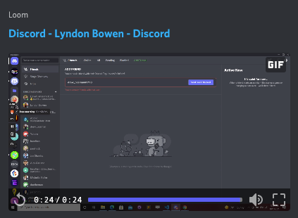

# EA Front-End Challenge
The following project is structured similar to a current project, including a sampling of our current programming languages, tools and libraries. The goal of this project is two parts. 1) Provide you a glimpse of how we work and the tools we use and 2) Give you an opportunity to showcase your skillsets related to the Frontend role.  This project plus reviews of your personal projects will help our team understand your strengths and areas for growth in development

## Challenge Overview
As the Front-End engineer your challenge is to create a working version of a single page web app, matching as closely as possible to the included Figma Design document.  The single page web app is meant for use as a dashboard for a content product for small business entrepreneurs.

Instructions:
1. Clone a project Repo and make a branch
1. Make sure you can view, edit, and build the current project before editing (See info related to NextJS below for help with this)
1. Use the project’s folder structure, included diagrams, link to the Figma Design Doc, and your skillz to finish building this Single Page web App
1. The data and assets are already in the project or accessible via mock data in project folder
1. A portion of the layouts, modules and components are already created and only need updates/edits to match the Figma design.  The remaining components in the design will need to be created leveraging the Figma design as a guide.
1. ChakraUI is installed but feel free, if you can, to solve the problem with CSS, Another UI Lib, CSS-In-JS, or a similar process
1. Focus on Layout and Design for both “Desktop & Mobile” and try and match Figma doc
1. Build and test locally then push your branch before the interview
1. We will discuss your project during the interview to understand how you tackled problems and your process for creating the page

**Please contact me, if you have any questions about the challenge or need any clarifications.**
Please contact me!
The best method is via Discord:
- My username:  `drew_beaman#1798`

If you are new to Discord:
 1 Follow this link: [Sign up to Discord](https://discord.com/register) to set up your discord account
 2 Once your account is setup, navigate to the friends section and type in my username  `drew_beaman#1798`

[Adding Me in Discord](https://www.loom.com/share/8c22f119135e4501b71857a9a9f2958b)

**🚨 if your portfolio contains a project that is similar please contact me! 🚨**

## Current Project Build

At the core it's HTML/CSS and Javascript.

We use  the javascript library [ReactJS](https://reactjs.org)

We use the React framework
[NextJS](https://nextjs.org/learn/basics/create-nextjs-app)

We are currently using Chakra-UI for our UI Library.
[chakra-ui](https://chakra-ui.com/)

Figma Design File:
[FrontEndChallenge](https://www.figma.com/file/dFFaPvdPrl9Ib1MtqXtPS1/FrontEnd-Challenge?node-id=2%3A245)

### EA's App Structure

### Design Images

## EA Engineering Links
[Environment Setup](devsetup/index.md)
## EA's Project Folder Structure & Github Process and Notes
[Project Process & Github Flow](devsetup/pages/projects.md)

## Notes
- [THINKING IN REACT](https://reactjs.org/docs/thinking-in-react.html)

- [ReactJS](https://reactjs.org)

- [NextJS](https://nextjs.org/learn/basics/create-nextjs-app)

- [chakra-ui](https://chakra-ui.com/)

- [Figma Share Link](https://www.figma.com/file/dFFaPvdPrl9Ib1MtqXtPS1/FrontEnd-Challenge?node-id=2%3A245)
